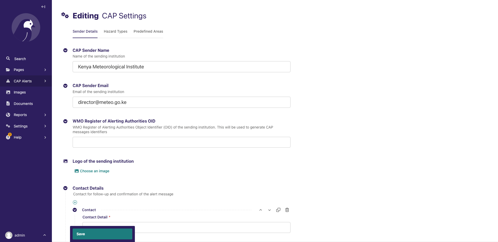

# CAP Composer Web

Running the Wagtail based CAP Composer as a standalone Wagtail site.

## Prerequisites

Before following the steps below, make sure you have the following set up:

- **Docker Engine & Docker Compose Plugin :** Ensure that Docker Engine is installed and running on the machine where
  you plan to execute the docker-compose command https://docs.docker.com/engine/install/. Docker Engine is the runtime
  environment for containers.

## Installation

### 1. Clone the Repository

```sh
git clone https://github.com/wmo-raf/cap-composer-web.git
```

### 2. Setup environmental variables

Copy the `.env.sample` file to a `.env` file

```sh
cp .env.sample .env
```

Edit and replace variables appropriately using your text editor. Here is an example using `nano` text editor.

```sh
nano .env
```

See [environmental variables' section](#environmental-variables) below for more details on the required variables

### 3. Build and Run the Docker Containers

```sh
docker-compose build
```

```sh
docker-compose up
```

To run the containers in the background, use the `-d` flag

```sh
docker-compose up -d
```

### 4. Create Superuser

```sh
docker-compose exec cap_web python manage.py createsuperuser
```

### 5. Access the Wagtail Admin

The admin interface can be accessed at `http://localhost:{CAP_NGINX_PORT}/{CAP_ADMIN_URL_PATH}`

## Environmental Variables

| Variable Name                | Description                                                                                                                                                                                                        | Required | Default Value           | Details                                                                                                                                                                             |
|:-----------------------------|:-------------------------------------------------------------------------------------------------------------------------------------------------------------------------------------------------------------------|----------|:------------------------|-------------------------------------------------------------------------------------------------------------------------------------------------------------------------------------|
| CAP_DB_USER                  | Postgres Database user                                                                                                                                                                                             | Yes      |                         |                                                                                                                                                                                     |
| CAP_DB_NAME                  | Postgres Database name                                                                                                                                                                                             | Yes      |                         |                                                                                                                                                                                     |
| CAP_DB_PASSWORD              | Postgres Database password                                                                                                                                                                                         | Yes      |                         | Avoid using the '@' and '$' or any other special characters without escaping them. If you have to include them, first make sure your password is URL-Encoded to avoid errors        |
| CAP_DB_VOLUME                | Docker Database volume path                                                                                                                                                                                        | Yes      | ./docker/dbdata         |                                                                                                                                                                                     |
| CAP_DEBUG                    | Django Debug mode                                                                                                                                                                                                  | No       | False                   |                                                                                                                                                                                     |
| CAP_SITE_NAME                | Wagtail Site name                                                                                                                                                                                                  | No       | CAP Composer            |                                                                                                                                                                                     |
| CAP_ADMIN_URL_PATH           | Admin URL path                                                                                                                                                                                                     | No       | cap-admin               |                                                                                                                                                                                     |
| CAP_TIME_ZONE                | A string representing the time zone for this installation.See the [list of time zones](https://en.wikipedia.org/wiki/List_of_tz_database_time_zones). Set this to your country timezone.                           | No       | UTC                     | [List of tz database time zones](https://en.wikipedia.org/wiki/List_of_tz_database_time_zones)                                                                                      |
| CAP_SECRET_KEY               | A secret key for a particular Django installation. This is used to provide cryptographic signing, and should be set to a unique, unpredictable value. Django will refuse to start if SECRET_KEY is not set         | Yes      |                         | Avoid the `$` here as well. You can use this online tool [https://djecrety.ir](https://djecrety.ir/) to generate the key and paste. Make sure it does not include the `$` character |
| CAP_ALLOWED_HOSTS            | A list of strings representing the host/domain names that this Django site can serve. This is a security measure to prevent HTTP Host header attacks, which are possible even under many seemingly-safe web server | No       | *                       | [Django Allowed Hosts](https://docs.djangoproject.com/en/4.2/ref/settings/#std-setting-ALLOWED_HOSTS).                                                                              |
| CAP_SMTP_EMAIL_HOST          | Django SMTP email host. Read more about sending Emails on Django [here](https://docs.djangoproject.com/en/5.0/topics/email)                                                                                        | No       |                         |                                                                                                                                                                                     |
| CAP_SMTP_EMAIL_PORT          | Django SMTP email port                                                                                                                                                                                             | No       |                         |                                                                                                                                                                                     |
| CAP_SMTP_EMAIL_USE_TLS       | Django SMTP email use TLS                                                                                                                                                                                          | No       | True                    |                                                                                                                                                                                     |
| CAP_SMTP_EMAIL_HOST_USER     | Django SMTP email host user                                                                                                                                                                                        | No       |                         |                                                                                                                                                                                     |
| CAP_SMTP_EMAIL_HOST_PASSWORD | Django SMTP email host password                                                                                                                                                                                    | No       |                         |                                                                                                                                                                                     |
| CAP_ADMINS                   | Django Admin emails                                                                                                                                                                                                | No       |                         |                                                                                                                                                                                     |
| CAP_DEFAULT_FROM_EMAIL       | Django Default from email                                                                                                                                                                                          | No       |                         |                                                                                                                                                                                     |
| CAP_STATIC_VOLUME            | Docker Static volume path                                                                                                                                                                                          | Yes      | ./docker/capsite/static |                                                                                                                                                                                     |
| CAP_MEDIA_VOLUME             | Docker Media volume path                                                                                                                                                                                           | Yes      | ./docker/capsite/media  |                                                                                                                                                                                     |
| CAP_TLS_VOLUME               | Docker CAP TLS volume path                                                                                                                                                                                         | No       | ./docker/capsite/tls    |                                                                                                                                                                                     |
| CAP_CERT_PATH                | CAP XML Signing Certificate path                                                                                                                                                                                   | No       |                         |                                                                                                                                                                                     |
| CAP_PRIVATE_KEY_PATH         | CAP XML Signing Private key path                                                                                                                                                                                   | No       |                         |                                                                                                                                                                                     |
| CAP_SIGNATURE_METHOD         | CAP XML Signature method                                                                                                                                                                                           | No       | RSA_SHA256              |                                                                                                                                                                                     |
| CAP_GUNICORN_NUM_OF_WORKERS  | Number of Gunicorn workers                                                                                                                                                                                         | No       | 4                       |                                                                                                                                                                                     |
| CAP_GUNICORN_TIMEOUT         | Gunicorn timeout                                                                                                                                                                                                   | No       | 300                     |                                                                                                                                                                                     |
| CAP_NGINX_PORT               | Docker Nginx port                                                                                                                                                                                                  | Yes      | 80                      |                                                                                                                                                                                     |
| CAP_BROKER_USERNAME          | MQTT Broker username                                                                                                                                                                                               | Yes      | cap                     |                                                                                                                                                                                     |
| CAP_BROKER_PASSWORD          | MQTT Broker password                                                                                                                                                                                               | Yes      |                         |                                                                                                                                                                                     |
| CAP_BROKER_QUEUE_MAX         | MQTT Broker queue max                                                                                                                                                                                              | Yes      | 1000                    |                                                                                                                                                                                     |

## Admin Interface

### 1. Access the Wagtail Admin

The admin interface can be accessed at `http://localhost:{CAP_NGINX_PORT}/{CAP_ADMIN_URL_PATH}`. Login with the
superuser credentials created in step 4. Below is how the admin interface will look when first accessed.


### 2. Update Wagtail Site Settings

Navigate to `Settings > Sites` to update the site settings.


Click on the default site (localhost) to edit:


`Hostname`: Should be the IP name or domain name of the site, `without` the protocol (http:// or https://).

`Port`: The port number where the site is running. For http, it is usually 80 and for https, it is usually 443.

`Site Name`: The name of the site.

### 3. Update CAP Base Settings

Before creating a CAP alert page, you will need to update the CAP Base settings. Navigate
to `CAP Alerts > CAP Base Settings`


#### Update CAP Sender Details

This section contains the details of the CAP sender. The details are used to populate the `sender` and `contact` element
in the CAP alert message.



#### Update Hazard Event Types

This section contains the list of hazard event types that can be used in the CAP alert message. This list should only
include events monitored by the sending authority. You can select from a list of WMO defined event types or add a new
custom one as monitored by the sending authority. You can select an icon to represent the event type.


#### Update Audience Types

This section contains the different audience types that can be used in the CAP alert message. You can create as many
audie types as needed. Usually, you might only need to create one audience type like `General Public` for public alerts.


#### Create Predefined Areas

This section contains the predefined areas that can be used in the CAP alert message. The CAP tool allows to create
alert areas using different tools including:

- Drawing a polygon on the map
- Drawing a circle on the map
- Selecting an area from pre-loaded Administrative Boundaries
- Selecting an area from a list of predefined areas

For an area to be selected from predefined areas, it needs to be created here first and saved. You can use the drawing
tools here to trace the predefined areas.


### 4. Create a CAP Alert

Navigate to `CAP Alerts > Alerts` to create a new CAP alert. Click on `Add cap alert page` to create a new alert. This
will open a form where you can fill in the details of the alert.


### 5. Importing CAP Alerts from external sources

The CAP Composer tool allows you to import CAP alerts published in the standard CAP XML from external sources. To import
CAP alerts, navigate to `CAP Alerts > Import CAP Alert`. You can import CAP alerts from a URL, Copied XML text or from a
file.


After loading and previewing the CAP alert, you can create a draft of the alert by clicking on the `Create Draft`
button. This will create a draft of the alert that you can edit and publish.


### 6. Signing CAP Alerts

You can provide a certificate and private key to sign the CAP XML alerts. These can be put in the `CAP_TLS_VOLUME`
directory, and named as `cert.pem` and `privkey.pem` respectively. The `CAP_TLS_VOLUME` directory is mounted to
`/app/tls` inside the container.

Then you will need to update the `CAP_CERT_PATH` and `CAP_PRIVATE_KEY_PATH` environment variables to point to absolute
paths of the cert and private key files respectively, as accessible inside the container.

For example, if the cert and private key files are placed on the root of `CAP_TLS_VOLUME` directory, the `CAP_CERT_PATH`
and `CAP_PRIVATE_KEY_PATH` should be set to `/app/tls/cert.pem` and `/app/tls/privkey.pem` respectively.

If you do not have a certificate and private key, you can generate a self-signed certificate and private key using the
following commands, and place them in the `CAP_TLS_VOLUME` directory.

```bash
openssl req -x509 -nodes -subj "/CN=<ip-or-domain>" -days 365 -newkey rsa -keyout privkey.pem -out cert.pem 
```

`NOTE:` Make sure to replace `<ip-or-domain>` with the IP address or domain name of the site.


